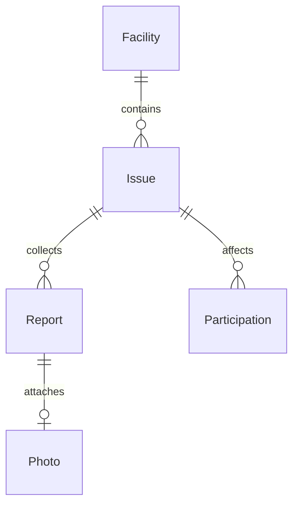

# 데이터 명세

실제 SQLite DDL 초안은 [schema.sql](schema.sql)이다. API는 camelCase, DB는 snake_case를 사용한다. 모든 시각은 서버가 UTC ISO 8601 밀리초 형식으로 기록하고 화면·예측 날짜는 Asia/Seoul로 변환한다.

## 관계

## 필드

| 테이블 | 필드 | 의미 |
| --- | --- | --- |
| facilities | id, name, location, kind | 고정 ID, 시설명·위치, printer/air_conditioner/water_dispenser |
| facilities | observed_from, created_at | 이력 수집 시작 시각과 등록 시각. 최초 신고 시각으로 대체하지 않음 |
| issues | id, facility_id, symptom, description | 고장 ID, 시설, 최초 신고의 증상과 대표 설명 |
| issues | status, eta_text | 처리 상태, 예상 처리 문구 또는 null |
| issues | created_at, updated_at, resolved_at | 생성·수정·최초 해결 시각 |
| reports | id, issue_id, client_id | 개별 신고와 연결 고장·익명 사용자 |
| reports | request_id, payload_hash | 요청 재전송 판별용 UUID와 정규화 입력 해시 |
| reports | symptom, description, created_at | 병합 전 원본 증상·설명·서버 접수 시각 |
| reports | dedup_method, merged | none/ai/mock/fallback, 기존 고장 연결 여부 |
| photos | id, report_id, storage_key, mime_type, byte_size | 신고당 최대 1장. 경로 대신 UUID 기반 저장 키 |
| participations | issue_id, client_id, created_at | 해당 고장의 고유 참여자와 최초 참여 시각 |
| app_metadata | key, value | `dataset_kind=live` 또는 `synthetic`, 데모 기준 시각 등 저장 |

시설 ID는 `printer-a`, `ac-307`, `water-1f`다. 새 고장·신고·사진·요청·clientId는 UUID를 사용한다. 테스트 전용 시드 ID는 읽기 쉬운 고정 문자열도 허용하되 실제 API의 clientId/requestId에는 UUID 검증을 적용한다.

`affectedCount`·예측값·`hasParticipated`는 저장하지 않고 조회 시 계산한다. 예측용 시계열 테이블도 P1에는 만들지 않는다. 참여자 원시 clientId는 응답으로 노출하지 않는다.

## 무결성 규칙

- `(issue_id, client_id)`는 유일하다. 참여는 `INSERT ... ON CONFLICT DO NOTHING` 후 COUNT를 조회한다.
- `reports.request_id`는 전역 유일하다. 같은 요청 ID·같은 payload는 이전 접수 결과를 재사용하며 원본·참여를 추가하지 않는다.
- payload 해시는 `[facilityId, clientId, symptom, trim(description), photoSha256OrNull]` 배열을 JSON 직렬화한 UTF-8 바이트의 SHA-256이다. photoSha256은 원본 업로드 바이트 기준 소문자 hex다. 같은 ID인데 내용이 다르면 409다.
- `merged`는 접수 당시 기존 고장 연결 여부를 보존한다. 새 신고 저장과 자동 참여는 같은 트랜잭션이다.
- `resolved_at`은 해결 상태에서만 값이 있다. 역방향 전이 금지는 서비스에서 검증한다.
- 병합은 신고의 연결 단위를 정할 뿐 기존 고장의 대표 설명·증상·처리 상태·ETA를 덮어쓰지 않는다.
- Issue.updatedAt은 상태·ETA 저장 시 갱신한다. 참여나 병합으로 수정하지 않으며 같은 값을 재저장해도 서버 저장 시각으로 갱신할 수 있다.
- 시설·고장·신고의 일반 삭제 API는 없다. 외래키는 RESTRICT다. 임의 삭제로 이력과 예측을 바꾸지 않는다.
- 문자열 길이·UUID·ISO 시각·시설 종류와 입력의 일치 검증은 서비스에서 수행한다. DDL 제약은 그 검증을 대체하지 않는다.

## 조회·인덱스

시설별 상태·생성 시각, 고장별 신고 시각, 사용자·신고 시각에 인덱스를 둔다. 영향 인원 집계는 participations의 복합 PK를 이용한다. 고장 목록과 참여 테이블을 집계한 뒤 정렬한다.

예측은 Report → Issue → Facility로 집계한다. Report 개수와 Participation 개수를 JOIN한 채 COUNT하면 수가 곱해질 수 있으므로 각각 독립 집계한다. 반복 고장은 Issue ID 기준, 예상 신고량은 시설·KST 날짜·clientId 기준이다.

## 시드와 데모 이력

`db:seed`는 시설 3개와 live 메타데이터를 빈 DB에 만들고 `observed_from=실제 시작 시각`으로 기록한다. 이미 synthetic인 DB에 실행해도 live로 바꾸지 않는다. 이력이 없는 기간을 신고 0건으로 채우지 않는다.

`db:seed:demo -- --reset`은 명시적으로 초기화하고 모든 이력을 synthetic으로 표시한다. 기준 T는 초기화하는 날의 KST 00:00이다. 예측 집계 구간은 [prediction.md](prediction.md)를 따른다.

| 시설 | 관측 시작 | 최근 4주 신고량(오래된 주→최근 주) | 최근 30일 고장 생성일 | 현재 고장·영향 인원 |
| --- | --- | --- | --- | --- |
| 프린터 A | T−60일 | 4, 6, 8, 10 | T−25일, T−15일, T−5일 | 출력 안 됨·접수됨·8명 |
| 307호 에어컨 | T−60일 | 2, 2, 2, 2 | T−20일, T−5일 | 성능 이상·확인됨·5명 |
| 1층 정수기 | T−10일 | 관측 이후만 2건 | T−5일 | 작동 안 됨·접수됨·2명 |

첫 28일 구간 이전부터 이어진 고장에 첫 주 신고를 연결할 수 있게 프린터·에어컨에 T−35일 고장 각 1건을 추가한다. 새로운 고장이 열리는 시각에 이전 고장을 해결해 과거 신고가 아직 생성되지 않은 고장에 연결되지 않게 한다.

신고는 각 주 구간 안에서 날짜·clientId를 결정적으로 배치해 표의 중복 제거 후 건수를 맞춘다. 참여 인원은 마지막 미해결 고장에 참여한 고유 ID 수다. 신고자를 반복 활용하고 필요하면 참여만 추가해 8/5/2로 맞춘다. 신고 시각은 연결 고장의 생성 이상·해결 미만이어야 한다. 최초 신고와 최초 참여도 빠뜨리지 않는다.

표의 수치는 데모 시드의 기대값이다. 시드 실행마다 별도 검사를 반복하지 않는다. 합성 이력은 실제 운영 지표·정확도 평가에 사용하지 않는다.

## 보존과 한계

일반 동작 중 해결된 고장·원본 신고를 유지한다. 사진은 로컬 데모 폴더 안에만 저장한다. 공개 운영 시 삭제 요청·보존기간·접근권한을 별도로 설계한다.

시설별 연속 수집을 가정한다. 서버가 장기간 중단돼 기록이 누락된 경우 운영자가 `observed_from`을 수집 재개 시점으로 옮겨 충분한 이력이 쌓일 때까지 예측을 중단한다. MVP에는 관측 공백을 자동 감지하는 기능이 없다.
